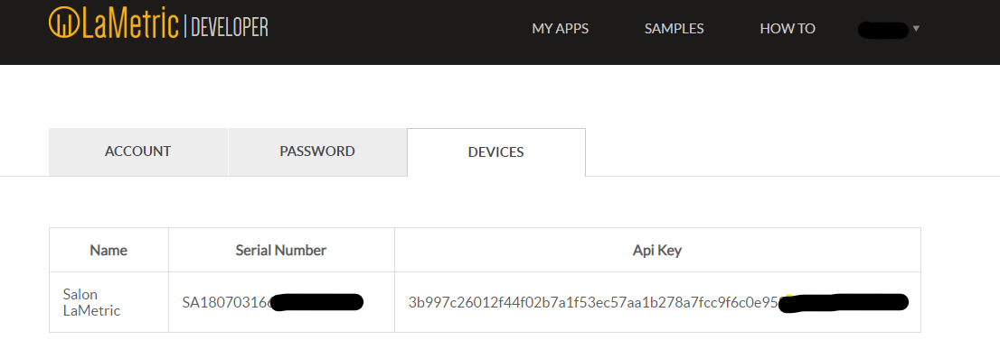
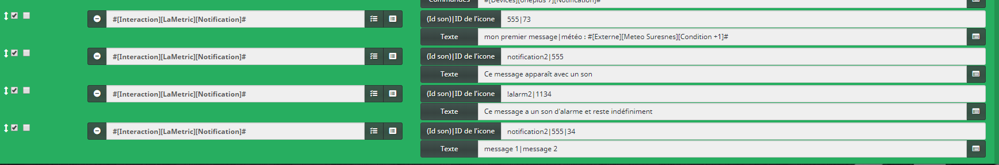

Plugin permettant d’afficher des notifications / informations sur
LaMetric.

Configuration du plugin 
=======================
## Configuration des notifications locales

Cette partie utilise l'API local de votre LaMetric et ne nécessite pas d'accès internet.
 
1. Creer un équipement LaMetric dans jeedom
2. Remplir la section "Options pour les notifications" avec l'ip local de votre LaMetric et mettre le token API

Pour trouver l'ip :
- Aller dans l'application mobile
- Ouvrir les paramètres
- Ouvrir les paramètres du wi-fi
- Récupérer l'ip

Pour trouver le token API :
1. -  Se rendre à l’adresse : <https://developer.lametric.com/user/devices> et recupérer la clé api

## Mode application

Une fois le plugin installé, il est nécessaire de créer une "indicator
App" sur le site LaMetric :

-   1\. Se rendre à l’adresse : <https://developer.lametric.com>

-   2\. Créer une "INDICATOR APP" :

-   3\. Configurer une icone, un nom et sélectionner Push dans "Communication
    type" :

-   4\. Donner un nom et une description à votre app et cocher "Private app"
    puis cliquer sur "Save" :

-   5\. Publier l’application puis installer-la sur votre LaMetric grâce à
    l’application mobile.

Une fois l’application publiée, vous disposez des informations
essentielles pour la configuration du plugin.

Vous pouvez ensuite créer un nouvel équipement dans Jeedom et renseigner
les champs demandés :

Utilisation du plugin 
=====================

4 commandes sont automatiquement créées lors de l’ajout d’un équipement
:
## Commande pour les notifications locales
-   **Notification** ⇒ Permet l’envoi de notification

-   **Vider notifications** ⇒ Permet de vider toutes les notifications affichées ou en attentes

## Commande pour l'application
-   **Message** ⇒ Permet l’envoi de messages

-   **Vider message** ⇒ Permet de remettre à vide l’affichage ("JEEDOM"
    s’inscrit alors)

## Utilisation de la commande message
La commande de type message contient 2 champs : \* **ID Icone** :
Correspond au numéro de l’icône souhaitée (Ne pas mettre le \# ; liste
des icônes disponibles ici : <https://developer.lametric.com/icons>) \*
**Texte** : Correspond au texte que l’on souhaite afficher

Il est possible d’envoyer plus de messages en un seul envoi en séparant
les icônes et les textes par le caractère : **|**

Voici par exemple un scénario envoyant 4 informations différentes en 1
seul envoi :

## Utilisation de la commande notification

Pour la commande notification il est également possible d'ajouté un son  lorsque la notification va s'afficher. Pour cela ajoutez le nom du son de notification ou d'alarme avant de mettre le séparateur **|** avant le premier Id d'icone
La liste des sons est disponible ici, dans la partie 'sound' : <https://lametric-documentation.readthedocs.io/en/latest/reference-docs/device-notifications.html> 

De plus, il est possible de forcer l'affichage de la notification indifiniment jusqu'à que le bouton sur LaMetric soit appuyé ou que la commande **Vider notifications** soit exécutée. Pour cela, il suffit d'ajouter **!** dans le premier charactère du champs des options

Voici quelques exemples:

